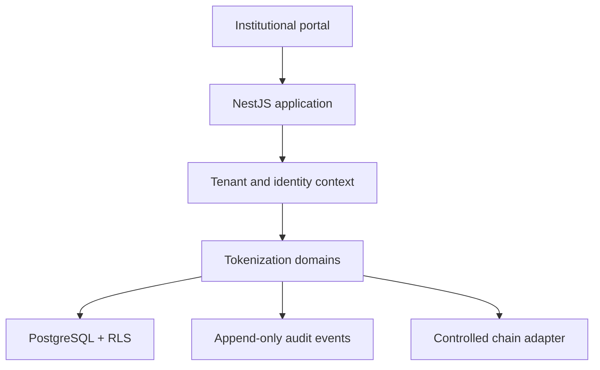

# RWA Tokenization Platform — Architecture Case Study

Sanitized architecture case study for an institutional B2B real-world-asset tokenization platform. It documents the Phase 1 foundation, security boundaries and readiness gates without claiming production deployment, legal approval or asset issuance.

## Design problem

RWA systems combine software, legal structures, identity, asset records and on-chain operations. A credible platform must preserve tenant isolation, authorization and auditability before adding transaction volume or expanding automation.

## Foundation scope

- Modular-monolith architecture with explicit bounded contexts.
- Next.js experience layer and NestJS application API.
- PostgreSQL tenant isolation reinforced with Row-Level Security.
- Least-privilege database roles.
- Append-only audit-event model.
- Redis reserved for bounded caching and asynchronous coordination.
- Docker-based local environment and repeatable delivery controls.

## Trust boundaries



The chain adapter is a controlled boundary. The case study does not assert that assets have been issued or that a production network is active.

## Core decisions

- **Defense in depth for tenancy:** application context and database RLS must agree.
- **Least privilege by default:** runtime roles cannot bypass tenant policies or mutate historical audit evidence.
- **Append-only accountability:** state-changing operations emit immutable business events.
- **Modular first:** bounded contexts remain in one deployable until scale evidence supports extraction.
- **Readiness before expansion:** later phases require security, operational and compliance gates to close.

## Technology signals

`Next.js` · `NestJS` · `TypeScript` · `PostgreSQL` · `Row-Level Security` · `TypeORM` · `Redis` · `Docker`

## Repository map

```text
.
├── docs/
│   ├── architecture.md
│   ├── readiness-gates.md
│   └── decisions/
│       ├── ADR-001-modular-monolith.md
│       └── ADR-002-tenant-isolation.md
├── README.md
└── SECURITY.md
```

## Scope and claim boundaries

This repository is educational portfolio material. It is not legal, investment or financial advice; it is not an offering document; and it does not contain deployable contracts, production credentials or private platform source.

## Author

[Julio Antonio Villalobo](https://github.com/julitodk06) — AI Transformation & Product Leader
