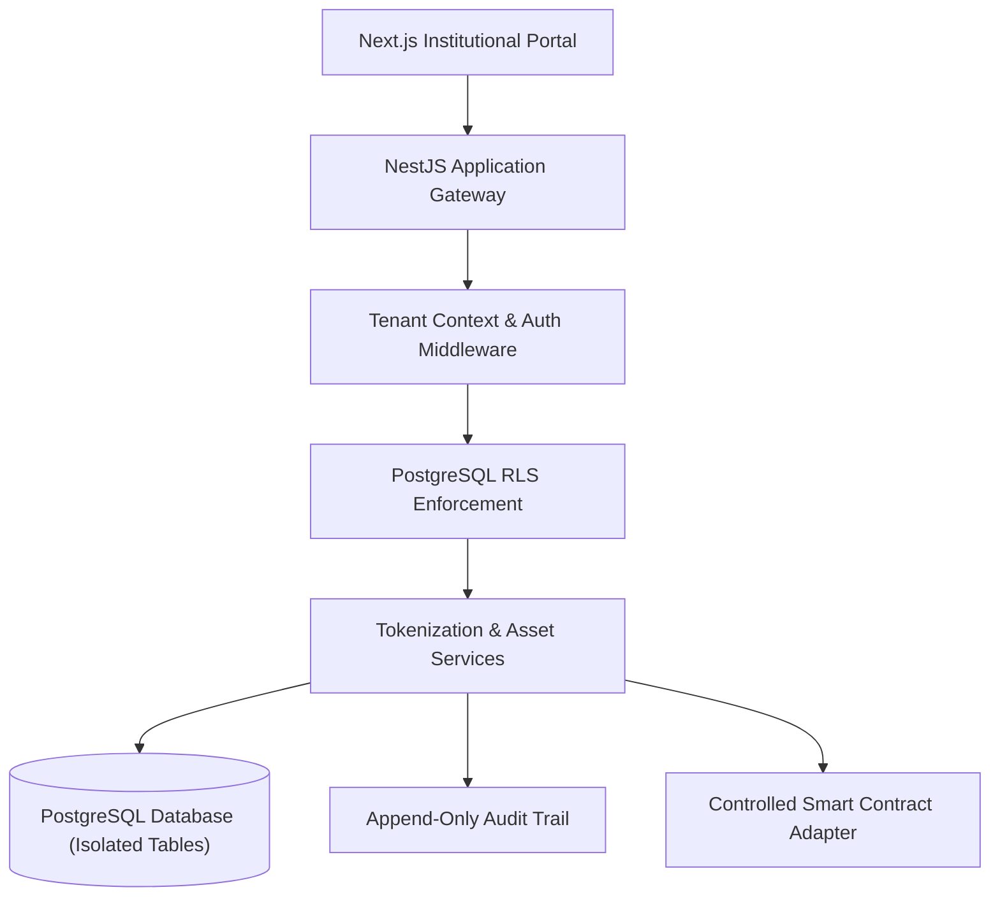

# RWA Tokenization Platform — Architecture Case Study

Sanitized engineering case study for an institutional B2B real-world asset (RWA) tokenization foundation. This repository documents the backend architecture, multi-tenant isolation model, and compliance boundaries designed to manage regulated digital asset lifecycles.

---

## 1. Architectural Problem

Asset tokenization platforms require uncompromising isolation between corporate issuers, verifiable audit trails, and strict authorization rules. The engineering challenge is ensuring that multi-tenant data, compliance status (KYC/AML), and on-chain interactions remain strictly partitioned, auditable, and resilient.

---

## 2. Technical Stack & Foundation

- **Backend Framework:** NestJS (modular monolith architecture with clean bounded contexts), TypeScript.
- **Frontend Layer:** Next.js (App Router), React, Tailwind CSS.
- **Database & Data Layer:** PostgreSQL with **Row-Level Security (RLS)** and least-privilege connection roles.
- **Caching & Async Events:** Redis for bounded caching and coordination.
- **Containerization & Dev Tools:** Docker Compose, TypeORM migrations, ESLint, Vitest.

---

## 3. Trust Boundaries & Data Flow

---

## 4. Key Architectural Decisions

1. **Fail-Closed Multi-Tenancy (Row-Level Security):** Database-level tenant isolation via PostgreSQL RLS policies (`PERMISSIVE` tenant matching), preventing accidental cross-tenant data exposure even if application-level filters fail.
2. **Append-Only Audit Logging:** Sensitive state transitions (investor onboarding, compliance status overrides, asset definition updates) trigger immutable audit events containing metadata without storing sensitive PII in plaintext.
3. **Controlled Chain Adapter Pattern:** Complete decoupling of business logic from blockchain network operations, allowing deterministic mocking in automated test suites and preventing network stalls from blocking transactional writes.
4. **Structured Testing & Validation:** Rigorous integration testing validating cross-tenant boundary isolation, reversible database migrations, and role authorization guards.

---

## 5. Repository Note

*This repository is a sanitized technical case study documenting Phase 1 architectural blueprints, security patterns, and testing strategies. Production keys, proprietary business rules, and client credentials remain private.*
