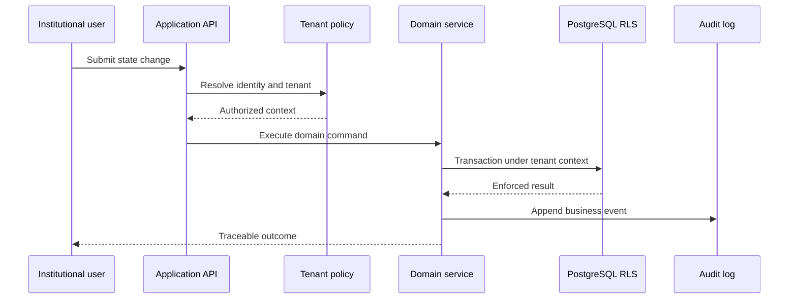

# Architecture Notes

## Bounded contexts

The reference platform separates the following responsibilities:

| Context           | Responsibility                                   | Primary control               |
| ----------------- | ------------------------------------------------ | ----------------------------- |
| Identity & Access | Users, organizations, roles and sessions         | Tenant-aware authorization    |
| Asset Registry    | Canonical asset records and lifecycle state      | Validated state transitions   |
| Compliance        | Eligibility and approval workflow hooks          | Explicit review gates         |
| Tokenization      | Issuance intent and chain-operation coordination | Idempotency and policy checks |
| Audit             | Immutable business-event evidence                | Append-only permissions       |

These are logical boundaries inside a modular monolith, not claims of independently deployed services.

## Transaction boundary

## External integrations

Custody, identity verification, payment rails and blockchain providers must sit behind explicit ports. Provider payloads are validated and translated into domain types so third-party schemas do not become the core model.
